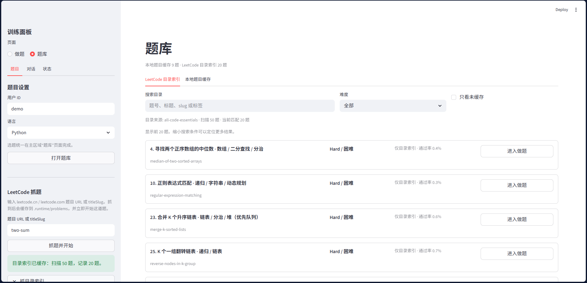

<!-- 文件用途：说明 coder-agent 项目简介、当前效果截图与后续优化方向。 -->

# coder-agent

面向 LeetCode 训练场景的 coding skills 训练 Agent，当前包含题目拉取、分级提示、提交运行、复盘分析与用户画像等能力。

## 一阶段效果图

## 实现 LeetCode 网络摘取

## 后续优化方向

### 优先处理

1. 清理废弃推荐链路
   - `agent/src/recommendation_engine.py` 当前只是 deprecated 文档壳，运行时代码没有引用它，可以删除。
   - 同步清理 `agent/prompts/recommendation.md` 和旧规划文档里的残留引用，避免误导后续维护。

2. 清理 Pydantic v1 兼容代码
   - `agent/requirements.txt` 已锁定 `pydantic>=2.7.0`，`agent/src/models.py` 中面向 Pydantic v1 的兼容 polyfill 可以删除。
   - 顺手移除只服务于旧兼容逻辑的无用 import。

3. 补齐核心测试覆盖
   - 当前测试主要覆盖 LLM 诊断与 SQLite 迁移，后续应优先补 `hint_engine`、`review_engine`、`profile_engine`、`leetcode_client`、`submission_runner` 的独立单测。
   - 测试优先覆盖纯业务逻辑、异常兜底、提示等级递增、复盘结果解析和本地运行协议。

4. 拆分 LLM 客户端职责
   - `agent/src/llm_client.py` 同时承担诊断状态、SDK 初始化、工具调用循环和 JSON 解析，职责偏重。
   - 建议在补测试后拆成 `llm_diagnostics.py`、`tool_call_executor.py` 和更轻量的 `llm_client.py`。

5. 统一错误边界
   - 不建议机械替换所有 `except Exception`，因为部分宽捕获用于降级到本地兜底。
   - 更合理的方向是引入 `LlmError`、`LeetCodeError`、`SubmissionError` 等领域异常，并在 UI 边界统一转成可展示诊断。

### 可穿插整理

1. 明确静态数据与运行时数据命名
   - `JsonStorage` 当前更像静态/seed JSON 读取器，`SqliteRuntimeRepository` 负责运行时 SQLite。
   - 可以将 `storage.py` 改名为 `seed_storage.py` 或 `static_storage.py`，同时评估 `JsonStorage.save_json()` 是否仍有保留价值。

2. 评估迁移代码保留期限
   - `agent/tools/migrate_runtime_json_to_sqlite.py` 已位于工具目录，可以保留。
   - `agent/src/runtime_migration.py` 仍有测试覆盖，建议确认旧 JSON 数据不再需要迁移后再删除。

3. 抽取配置读取公共逻辑
   - `load_openai_config()` 和 `load_leetcode_config()` 存在少量重复的文件存在性检查、配置读取和 section 校验逻辑。
   - 该问题优先级较低，可在后续改配置模块时顺手抽 helper。

4. 补齐模型类中文 docstring
   - 按当前仓库规范，`agent/src/models.py` 中对外模型类应补中文 docstring。
   - 后续修改该文件时，建议和 Pydantic v1 兼容清理一起完成。

### 不建议调整

- `agent/src/submission_runner.py` 中隔离子进程 runner 使用 stdout 输出 JSON 结果，这是父进程解析执行结果的协议；不建议改成 logging，否则可能破坏 `json.loads(process.stdout)` 的调用链。
